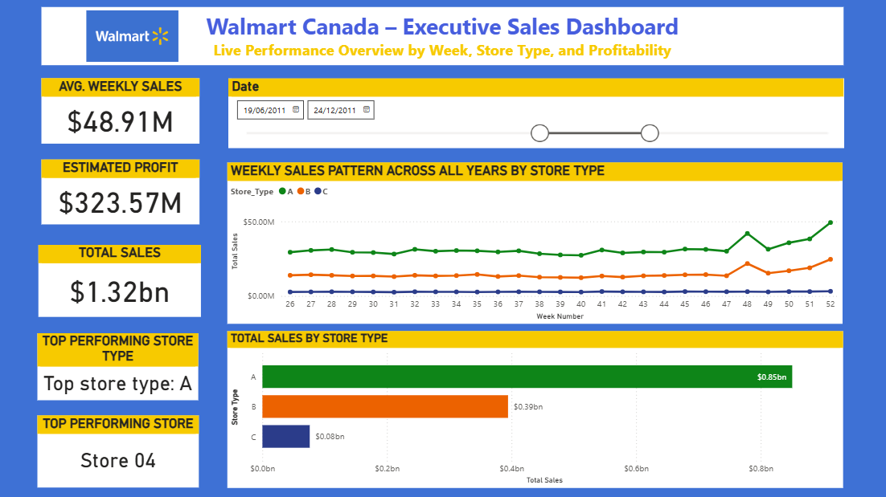

# Walmart Sales Forecasting – Power BI

A production‑style Power BI project that analyzes Walmart Canada’s weekly sales and profitability and surfaces store‑level insights with drill‑through. The model is lightweight (fact + dimension), refreshes from raw CSVs hosted on GitHub, and follows PL‑300 best practices.

## What’s inside
- **Executive Overview** – live KPIs, weekly sales pattern, top store type
- **Profitability Insights** – store-type breakdown, holiday vs non‑holiday profit, weekly profit trend, smart narrative
- **Reusable DAX library** – curated measures for KPIs, tooltips, and storytelling
- **Automated inputs** – data pulled directly from GitHub raw CSVs (Power Query)

## Dataset
- `train.csv` – weekly sales by store & department  
- `features.csv` – fuel prices, markdowns, CPI, temperature, holidays  
- `stores.csv` – store type & size  

_Source:_ Kaggle Walmart Sales (hosted via GitHub for reproducible refresh)

## Data model
Star schema:
- **Fact**: `SalesFact` (Date, Store, Dept, Week_Num, Weekly_Sales, markdowns, economic drivers)
- **Dim**: `Stores` (Store, Store_Type, Size, formatting fields)
- Relationship: `Stores[Store] 1 ─── * SalesFact[Store]`

## Key KPIs (DAX)
- **Total Sales**
- **Estimated Profit** (assumed margin 24.5%)
- **Avg Weekly Sales / Profit** (context‑aware by selections)
- **YoY Sales Growth**
- **Top Store Type** + narrative/tooltip helpers
  
### DAX
- Measures: [dax/measures/core_measures.dax](dax/measures/core_measures.dax)
- Calculated columns: [dax/calc-columns/fact_and_dim_columns.dax](dax/calc-columns/fact_and_dim_columns.dax)
- KPI notes: [Docs/KPIs.md](Docs/KPIs.md)

## Screens
See `/Screenshots` for full dashboards (Executive Overview & Profitability Insights) with drill‑through examples.

## How to open and refresh
1. Open **PowerBI_Files/Walmart_Sales.pbix** in Power BI Desktop.
2. If prompted, set **Anonymous** credentials for `https://raw.githubusercontent.com/`.
3. Home → **Transform data** (review) → **Close & Apply** → **Refresh**.

## Repo structure
- `PowerBI_Files/` – PBIX (Git LFS)
- `Data/` – `train.csv`, `features.csv`, `stores.csv` (raw inputs)
- `powerquery/queries/` – M code for `Sales`, `Features`, `Stores`, `Sales_Stores`, `SalesFact`
- `dax/measures/` – `core_measures.dax`
- `dax/calc-columns/` – `fact_and_dim_columns.dax`
- `assets/screenshots/` – dashboard images
- `Docs/` – notes (e.g., KPIs.md)

### Notes
- `YoY_Sales_Growth_v2` uses the selected **Year** and compares to the prior year (first year shows blank).
- “Top Store” is filter-aware (respects slicers); “Top Store Type” is a separate KPI on purpose.

## Preview

